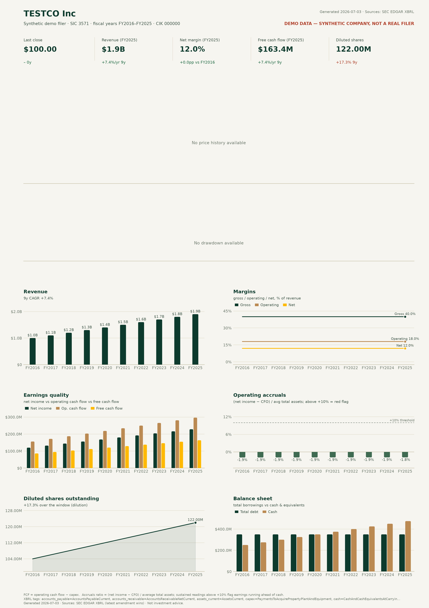
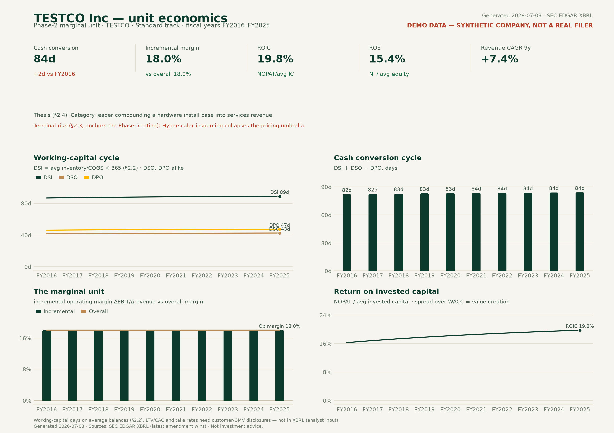
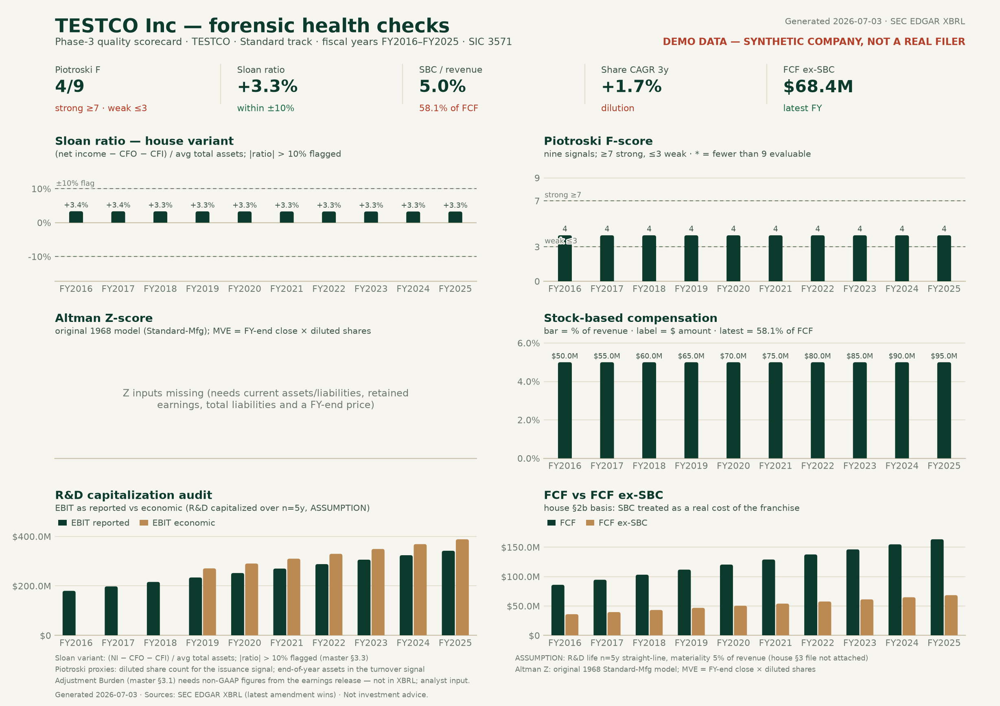
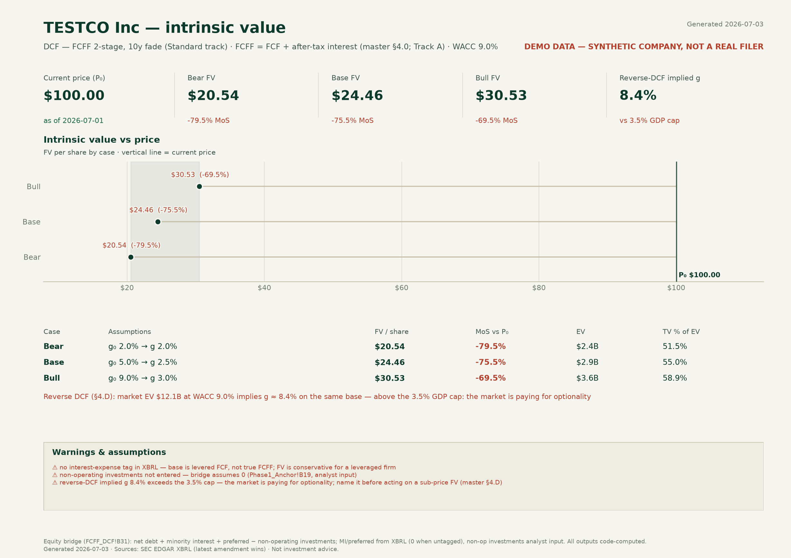
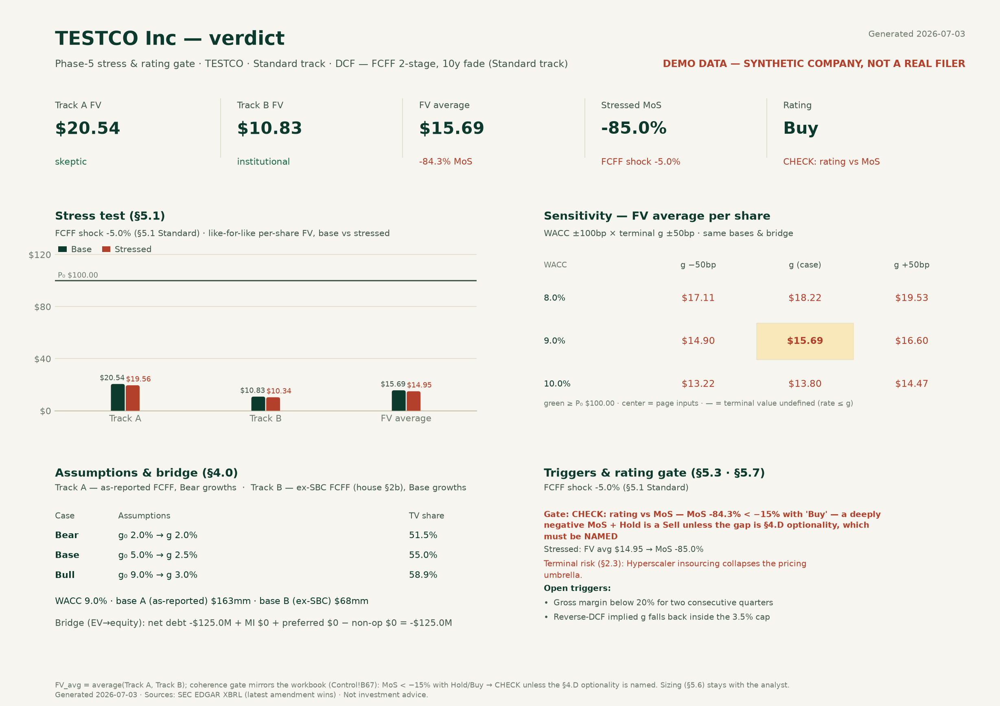

# Forensic Stock Viz

A Windows desktop tool for forensic financial analysts: type a US-listed
ticker and get the full five-phase report — 10-year performance dashboard,
**Phase-2 unit economics**, **Phase-3 forensic health scorecard**,
**Bear/Base/Bull intrinsic value** with auto-built WACC, and the **Phase-5
stress test + coherence-gated verdict** — built from primary sources
(as-filed SEC XBRL) with a CSV audit trail. It can also **fill the
`forensic_valuation_model_v3.xlsx` shell** (Fill workbook… / `--xlsx`):
57+ of the 133 blue input cells populated from the app's data, formulas
untouched, and a to-do list of the analyst cells with suggested sources
(see [docs/SOURCE_MAP.md](docs/SOURCE_MAP.md)).







## Quick start (Windows)

1. Install Python 3.10+ from <https://www.python.org/downloads/>
   (tick **"Add python.exe to PATH"** during setup).
2. Double-click **`run_windows.bat`**. The first run creates a local
   virtual environment and installs the dependencies; later runs start
   instantly.
3. Type a ticker (e.g. `AAPL`), pick the **Years** window (3/5/7/10) and
   **Track**, press **Analyze**. The report opens as tabs (Watchlist /
   Dashboard / Unit economics / Health / Valuation / Verdict);
   **Interactive report ↗** opens the zoomable, hover-tooltip HTML rendition
   in your browser, and **Save PDF (A4)…** / **Financial model…** /
   **Fill workbook…** produce the deliverables.

**Watchlist & verdict ledger (§5.7).** Every computed verdict logs
automatically to a local SQLite ledger (`ledger.db` next to the cache); the
Watchlist tab shows ticker / rating / FV_avg / MoS / stressed MoS / price
date / age, flags stale rows in red (> ~5 trading days, house §8), tracks
open triggers, and re-runs a name on double-click. CLI: `--ledger` prints it,
`--ledger-import seed.json` loads your `verdict_ledger_seed.json` (imported
rows are marked [Likely] — verify vs the original workbooks).

**Compare.** **Compare…** (or `--compare "AAPL,MSFT,GOOG"`) builds a
side-by-side interactive page for 2–4 tickers — indexed price and revenue
(common base, one axis), net margin, ROIC, FCF margin, and a KPI table that
pulls each name's ledger rating/FV/MoS. Colors are fixed per ticker across
every chart (color follows the entity).

**Interface.** The app is per-monitor **DPI-aware**: at 125/150% Windows
scaling the shell stays crisp (no bitmap stretching), report pages render at
your true display DPI, and resizing or maximizing **re-renders them sharp and
centered** after a short debounce. It ships a proper window/taskbar icon and
a menu bar (File / Tools / Help); **Tools → Settings…** persists the SEC
User-Agent, an optional house-assumptions file and the default years window
to `settings.json` in `%LOCALAPPDATA%\ForensicStockViz\` (next to the cache
and `ledger.db`) — environment variables always win over saved settings.
Long fetches show a progress bar with a **Cancel** button (cooperative: the
run stops at the next pipeline stage), and Escape closes every dialog. The
owner-run acceptance pass for all of this lives in
[docs/UI_VALIDATION.md](docs/UI_VALIDATION.md).

**House look & display charts.** Every surface — the Tk shell, all five
report pages, the interactive and compare reports — follows the house colour
scheme (Colour Palette 07: forest `#0C3B2E`, tan `#BB8A52`, amber `#FFBA00`,
sage `#6D9773` on a cream surface; brick red is reserved for negative/stale
status, never a series colour — see `forensic_viz/palette.py` for the
validator record). The interactive report opens with Fiscal.ai-style
**Revenue** and **Operating Profit** display charts: value-labelled bars
plus a YoY %-change line with point labels, **Total Change and CAGR in the
legend**, and the %-change line **toggles off with a legend click**.

**Valuation sandbox.** The interactive report embeds a **live DCF** for
Standard-track names: drag WACC / g₀ / terminal-g sliders (or edit the base
FCFF, toggle ex-SBC) and FV, MoS, TV-share and the reverse-DCF implied g
recompute instantly in the browser — a JS replica of the §4.A engine,
numerically parity-tested against the Python model
(`tests/test_sandbox_parity.py`, 200-point grid, 1e-9), which remains the
audited record for every export.

Command line (same launcher):

```bat
run_windows.bat AAPL --model      :: one-sheet financial model XLSX (FY + quarters + LTM)
run_windows.bat AAPL --csv        :: AAPL_10y_report_<date>.pdf (A4) + audit CSVs
run_windows.bat AAPL --years 5    :: 5-year window
run_windows.bat AAPL --html       :: interactive HTML report (plotly, offline)
run_windows.bat AAPL --png        :: per-page PNGs instead of the PDF
run_windows.bat MSFT --no-cache   :: bypass the local cache
run_windows.bat WFC --track bank  :: override the Logic Track (auto = from SIC)
run_windows.bat AAPL --adjusted-ni 105e9  :: fluff filter (non-GAAP NI, from the release)

:: intrinsic value — WACC auto-builds; omitted dcf cases pre-fill from analyst
:: consensus (Bear <- low, Base <- average, Bull <- high; terminal g 2.0%)
run_windows.bat AAPL --value dcf --rating Buy
run_windows.bat AAPL --value dcf --bear 0.02,0.02 --base 0.05,0.025 --bull 0.09,0.03
```

To produce a standalone `ForensicStockViz.exe` (no Python on the target PC),
run **`build_exe_windows.bat`** once; the binary lands in `dist\`.

## What the report shows

**Page 1 — performance dashboard (10 fiscal years):**

| Panel | Forensic reading |
|---|---|
| **KPI row** | Last close + 10y return, latest revenue + CAGR, net margin change, FCF + CAGR, diluted shares (red = dilution) |
| **Price / drawdown** | 10y split-adjusted daily close; % below rolling peak with the max-drawdown point marked |
| **Revenue** | Annual as-filed revenue, labelled per year, CAGR |
| **Margins** | Gross / operating / net margin trend — divergence between gross and net is where to start reading footnotes |
| **Earnings quality** | Net income vs operating cash flow vs FCF. NI persistently ahead of CFO = accrual build-up |
| **Operating accruals** | (NI − CFO) / average total assets, diverging bars; the dashed **+10% line** is the aggressive-accruals threshold |
| **Diluted shares** | Dilution vs buyback over the window |
| **Balance sheet** | Total borrowings vs cash & equivalents |

**Page 2 — Phase-2 unit economics (master prompt §2), track-aware:**

| Track | Panels |
|---|---|
| **Standard / SOTP** | Working-capital cycle (DSI = avg inventory/COGS × 365, DSO, DPO — §2.2), cash conversion cycle, **the marginal unit** (incremental operating margin ΔEBIT/Δrevenue vs overall), ROIC vs the auto-built WACC |
| **Bank** | NIM on the avg-total-assets proxy (earning assets aren't tagged — labeled), PCL trend, ROE |
| **Insurance** | Loss ratio (benefits/NEP) and combined ratio where UW expense is tagged (100% break-even line), net earned premiums, ROE |
| **REIT** | Revenue growth, ROE, plus an honest note: NOI/same-store/FFO→AFFO are non-GAAP — analyst input |

The header carries the **investment thesis (§2.4)** and the **Terminal Risk
(§2.3, anchors the Phase-5 rating)** — judgment by definition, so they're
analyst inputs (the **Analyst inputs…** dialog or `--thesis` /
`--terminal-risk`), printed verbatim on the report and in the CSV. §2.1
revenue architecture (segments, geography, ≥10% customer concentration) is
**dimensional XBRL that the companyfacts API doesn't return** — the page says
so instead of pretending; LTV/CAC and take rates need customer/GMV disclosures
that aren't in XBRL either.

**Page 3 — Phase-3 forensic health checks (master prompt §3):**

| Check | Definition / threshold |
|---|---|
| **Sloan ratio (house variant, §3.3)** | (NI − CFO − CFI) / avg total assets; \|ratio\| > 10% flagged in red |
| **Piotroski F-score (§3.3)** | Nine classic signals per year; ≥7 strong, ≤3 weak; `*` marks years with fewer than 9 evaluable |
| **Altman Z (§3.3, Standard-Mfg)** | Original 1968 model with zone bands (distress < 1.81 / grey / safe > 2.99); MVE = FY-end close × diluted shares; suppressed for SIC-6xxx financials |
| **SBC & dilution (§3.4)** | SBC in $ and % of revenue, % of latest FCF, 3-yr diluted share CAGR |
| **R&D capitalization audit (§3.2)** | EBIT reported vs economic, R&D capitalized straight-line over n=5y (ASSUMPTION); shown only when R&D ≥ 5% of revenue |
| **FCF vs FCF ex-SBC (house §2b)** | SBC treated as a real cost of the franchise |

**Track-aware panels** (pick the Logic Track in the GUI toolbar or `--track`;
auto = from the SIC code, and the economic engine beats the vendor code):
Bank/Insurance tracks replace Altman Z with a **solvency panel** — CET1 /
Tier-1 / Tier-1-leverage regulatory ratios as filed (Basel reference lines at
4.5% / 7%), with equity/assets as the fallback when the ratios aren't tagged —
and the Bank track swaps the R&D audit for a **credit-reserve audit**
(allowance for credit losses vs annual provision; both falling = a reserve
release flattering earnings).

**Fluff filter (§3.1)** — the Adjustment Burden needs the non-GAAP figure from
the earnings release (not in XBRL), so it's analyst input: the **Fluff
filter…** button (or `--adjusted-ni`) takes adjusted net income and the app
computes |Adjusted − GAAP| / |GAAP|, flagging > 20% on the health-page KPI row.
NIM and insurance reserve development remain analyst work.

**Page 5 — Phase-5 stress & verdict (master prompt §5.1–5.3):** computed
automatically with every valuation. Dual-track FVs (Track A = as-reported
FCFF with Bear growths; Track B = ex-SBC base with Base growths, house §2b),
**FV_avg = average(A, B)** and MoS exactly as the workbook computes them,
the track-specific stress (Standard −5% FCFF₁ · Banks −100 bps NIM ·
Insurance +5 pts CR · REITs +100 bps yield) re-run through the same model on
**both** tracks (the shell stresses Track B only), and the **rating coherence
gate** — a superset of Control!B67: MoS < −15% with a Hold/Buy/Strong-Buy
rating → CHECK, unless the §4.D optionality is named *and* the reverse-DCF
implied g exceeds the GDP cap. The rating itself is yours (dialog dropdown /
`--rating`); the app never invents one. Sizing (§5.6) is not yet ported; the
verdict ledger (§5.7) shipped (Watchlist tab / `--ledger`).

**Page 4 — intrinsic value, Bear / Base / Bull (master prompt Phase 4):**

Click **Intrinsic value…** in the GUI (or use `--value` on the CLI). Pick the
method — the app pre-selects it from the SIC code, and you override it when the
economic engine differs from the vendor code:

| Method | Model | Your inputs per case |
|---|---|---|
| **DCF** (§4.A, Standard track) | FCFF 2-stage, 10-year linear fade, equity bridge, plus the §4.D reverse-DCF implied-g frame | stage-1 growth g₀, terminal growth g (base FCFF defaults to latest FY FCF; tick ex-SBC for the Track-B basis) |
| **Residual income** (§4.B, Banks/Insurance) | RI at rₑ off latest book equity | sustainable ROE, book-growth g₀, terminal g |
| **AFFO yield** (§4.C, REITs) | FV/sh = AFFO per share ÷ target yield | AFFO per share, target yield (analyst-supplied) |
| **Manual / SOTP** | analyst-supplied FV per share | FV per share (segment economics aren't in XBRL) |

For the DCF, the growth cases **pre-fill from analyst consensus revenue
estimates** (Yahoo `earningsTrend`, +1y vs 0y): Bear ← the low estimate,
Base ← the average, Bull ← the high, with terminal g at the 2.0% house
default — every value editable in the dialog, and the source + analyst count
shown. The app returns FV per share and **margin of safety vs the last
close** for all three cases, drawn as a football field against the price
line, with the **reverse-DCF sanity frame (§4.D)** printed under the case
table. The implied g is computed on the **Track-B ex-SBC base over market EV
including the bridge legs, mirroring Control!B58/B57** — vs the 3.5% GDP cap.

**The discount rate auto-builds (master §4.0)** and pre-fills the dialog
(editable): live **10-Y UST** from FRED's keyless CSV (Stooq's 10-year yield
as fallback), **β** as a Blume-adjusted regression of the stock's weekly
returns vs the S&P 500 over the shared history, **ERP** as a labeled house
ASSUMPTION (`config.ERP_ASSUMPTION`), **r_d** from interest expense / average
debt, **τ** from the filing. The whole chain is printed on the page as the
rate-build audit line; every missing leg degrades to a labeled ASSUMPTION and
the analyst can always override the final number.

For the DCF the base is **true FCFF** — levered FCF (CFO − capex) plus
after-tax interest (§4.0), so discounting at WACC and the net-debt bridge are
internally consistent; with no interest-expense tag it falls back to levered
FCF and says so. Guardrails: terminal g capped at 3.5% (warned), discount rate
must exceed terminal g (hard error), TV-share-of-EV flagged when dominant,
stale price (> 5 trading days) warned (house §8). The **equity bridge** is
`net debt + minority interest + preferred − non-operating investments`
(FCFF_DCF!B31): MI and preferred come from XBRL automatically (0 when untagged,
with a note), and non-operating investments are analyst input via the Analyst
inputs… dialog or `--non-op-investments`. Remaining simplifications, stated on
the page: converts and finance leases are not split out of total debt, and
pensions are not modeled. In the GUI, percent fields are entered in **percent**
(`9` = 9%, `160` = 160%); on the CLI, `--wacc`/`--bear`/… take **fractions**
(`0.09`).

The **Financial model export** (**Financial model…** / `--model`) is the
data deliverable: one sheet, three statements — income statement, balance
sheet and cash-flow statement consolidated in the analyst's model-template
layout. Columns run fiscal years, then the **last four fiscal quarters**
(spanning the FY boundary, `Q3'25 Q4'25 Q1'26 Q2'26` style), then **LTM**.
The sheet **adapts to each company's own SEC presentation**: lines the
filer never tags are dropped, opex appears as the split lines (Sales &
Marketing / G&A) or the combined SG&A — whichever the company files — and
labels follow the winning tag (e.g. "Technology & Development"). Quarterly
values come from as-filed 10-Q XBRL under the same winning tags as the
annual series: discrete 3-month values when filed, else fiscal-YTD
differencing (10-Q cash-flow statements are YTD-only), with fiscal Q4
derived as FY − 9-month YTD; LTM = last FY + latest YTD − year-ago
comparative YTD; balance-sheet rows show period-end balances. **% change
rows** sit under the key line items — YoY in the fiscal-year columns and
**YoY vs the same fiscal quarter a year earlier** in the quarter columns
(QoQ is deliberately not shown; seasonality makes it noise). The footer
records the derivation rules and the exact XBRL tag per concept. Raw
audit-trail CSVs remain available on the CLI via `--csv`.

**As-filed statement sheets (staging layer).** Alongside the curated Model
sheet, the export carries one sheet per primary statement — **Income
Statement**, **Balance Sheet**, **Cash Flow** — with every tagged line in
the filer's own order and labels, plus a per-axis **Segments** sheet;
downstream extraction reads from this workbook. Mechanism (XBRL-only, no
HTML scraping): the latest 10-K's `FilingSummary.xml` locates the three
consolidated-statement roles, the **presentation linkbase** (`…_pre.xml`)
gives line order/indent/total flags, the **label linkbase** (`…_lab.xml`)
gives the as-filed labels, and values come from **companyfacts** for all
displayed fiscal years (latest amendment wins) — so the sheets show the
current as-filed structure with full multi-year columns. Signs are raw
as-filed (presentation-negated rows display the raw XBRL value). The
boundary is honest: "all the data" means all *tagged* data — operating
KPIs disclosed in MD&A (GMV, TPV, NIMAL, active users/buyers, items sold,
payment transactions) are not XBRL-tagged and are outside this export.

Units live in the section headers (`INCOME STATEMENT ($mm; EPS in $, shares
in mm)` · `BALANCE SHEET (period end, $mm)` · `CASH FLOW STATEMENT ($mm)`)
and every cell carries a number format chosen by row kind:

| Row kind | Excel format | Reads as |
|---|---|---|
| Money rows ($mm) | `#,##0.0;(#,##0.0);"–"` | `20,335.0` · `(1,204.5)` · zero → `–` |
| Per-share (diluted EPS) | `0.00;(0.00);"–"` | `6.13` |
| Share counts (mm) | `#,##0.0` | `15,744.2` |
| % change & tie checks | `+0.0%;-0.0%;"–"` | `+12.4%` · `-3.1%` |

**Segment line items (§2.1 / SOTP).** Segment splits — reportable
segments, product/service disaggregation (e.g. Commerce vs Fintech),
geography (e.g. Brazil/Mexico/Other) — are **dimensional XBRL that the
companyfacts API never returns**, so the app reads them from the
**extracted XBRL instances of up to `segment_history_years` fiscal years
of 10-Ks (default 10) plus the latest 10-Q** (fetched live, cached for a
year — filed instances are immutable). Values merge **as-latest-restated
per span** (later-filed wins); **recasts, membership breaks, and
per-instance coverage are footnoted in the model export** — a segment
definition change is never auto-spliced into a continuous-looking series,
and a renamed member merges only via an analyst-declared alias in the
house file (`[segment_aliases.<TICKER>]`). They appear as a **SEGMENTS
(as filed)** section in the financial model (revenue and operating income
per member, with % change rows), auto-fill the **Phase-2 revenue
architecture block** of the valuation workbook (top-2 segments +
remainder, names as cell comments), and when a filer reports 2+ parts the
health page and the valuation dialog flag it as an **SOTP candidate**.
Honesty clause: dimensional tagging of the segment note is reliable for
large filers from roughly FY2012–2013; older and smaller filers may yield
blanks that no fetcher fixes.
Every revenue block carries a visible **tie-out** — `Σ members` and
`vs consolidated (gap %)` rows against the consolidated statement: a
positive gap flags hierarchical (parent + child) members double-counting
on the axis (which also **gates the Phase-2 auto-fill**), a negative gap
means untagged members; values synthesized from a two-axis
disaggregation render in italics.

## Basis coherence (FIX-11)

Filers can tag **two undimensioned revenue totals** (MELI: headline
`Revenues` and the contract-only ASC-606 subtotal) while COGS and Gross
Profit sit on the headline basis — coverage scoring alone can pick the
wrong one and put every revenue-denominated ratio on a mixed basis. The
app therefore lets the income statement referee itself:

- **Revenue referee rule:** per fiscal year, the selected revenue tag must
  satisfy `Revenue ≈ Gross Profit + Cost of Revenue` (±`is_tie_tol`,
  default 2%). Failing years substitute the coherent candidate (recorded
  per year in the tags footnote and as a health note); years with no
  coherent candidate keep the winner and carry an UNRESOLVED warning —
  never fabricated. Quarter cells follow the same basis decision.
- **IS tie row:** the model export shows `Rev − COGS vs GP (gap)` under
  Gross Profit — a basis break is visible on the sheet's face, red beyond
  tolerance, with an explanatory footnote.
- **LTM basis provenance:** a derived LTM (e.g. FCF) only combines legs
  that share a basis; a trailing-twelve-month CFO minus a fiscal-year
  capex is suppressed and footnoted rather than silently mixed. Interim
  gap-fill across sibling tags is logged verbatim in the footnotes.
- **SBC override doctrine:** when the tagged SBC series dies under every
  candidate (MELI), Track B warns loudly; the analyst sets the override
  from the comp note (**Analyst inputs…** / `--sbc-override`).
  Capitalized-cost SBC elements (`…CapitalizedAmount`) are excluded by
  design — capitalized ≠ expensed.

## House assumptions file

ERP, the GDP cap, R&D life, and the Phase-5 stress shocks default to labeled
ASSUMPTIONs. To use your firm's numbers, copy `house_assumptions.example.toml`
to `house_assumptions.toml` (gitignored — real values are never committed) and
edit it, or point `HOUSE_ASSUMPTIONS_FILE` at a file elsewhere. When a house
file loads, the report labels flip from "ASSUMPTION" to "house".

## Data sources & methodology

- **Fundamentals** — SEC EDGAR XBRL `companyfacts` API. Annual (10-K family)
  values only; a later-filed amendment (10-K/A) supersedes the original.
  Tag selection is **coverage- and recency-scored**: when a company migrates
  tags (e.g. `Revenues` → `RevenueFromContractWithCustomerExcludingAssessedTax`
  after ASC 606), the tag covering the recent fiscal years wins, so the series
  can't silently end years ago. Because a 10-year window usually spans such a
  migration, years the winning tag misses are filled from the next-ranked tag
  and the mix is **recorded in the audit string** (footer + CSV) — never silent.
- **Prices** — Stooq daily CSV (keyless), falling back to the Yahoo Finance
  chart API. Split-adjusted closes. If both fail, the dashboard still renders
  from fundamentals alone.
- **Derived** — FCF = CFO − capex. Gross profit falls back to
  revenue − cost of revenue when `GrossProfit` isn't tagged. Total debt =
  long-term debt (current + noncurrent) + short-term borrowings, falling back
  to `LongTermDebt`. Accruals ratio uses average total assets.

### SEC access requirements

The SEC requires an identifying User-Agent; the default is set in
`forensic_viz/config.py` and overridden with the `SEC_EDGAR_USER_AGENT`
environment variable (`name email`). **`www.sec.gov/Archives` returns
HTTP 403 for the placeholder UA** (verified live), so Archives-dependent
features — segment instances, the as-filed statement sheets — refuse to
run on the placeholder and say exactly what to set; `data.sec.gov`
(companyfacts, submissions) currently tolerates it, so fundamentals stay
usable either way.

Cached responses live in `%LOCALAPPDATA%\ForensicStockViz\cache`
(fundamentals 24 h, prices 6 h) so re-runs are instant and polite to the APIs.

## Limitations (v1)

- **US-GAAP filers only.** IFRS-only foreign private issuers are rejected
  with a clear error rather than mis-parsed.
- Banks/insurers/REITs render, but revenue-family tags vary by sector; check
  the footer tags before trusting a sector outlier (wrong-track selection is
  the known failure mode — see `ARCHITECTURE.md` Layer B in the project docs).
- Prices come from free unofficial endpoints; they are for context, not
  execution.
- This tool automates the deterministic layer only. It deliberately does
  **not** attempt judgment calls (adjustment burden, one-time items, organic
  vs. acquired growth) — those stay with the analyst.

## Development

```bash
pip install -r requirements.txt pytest
python -m pytest tests/          # full offline suite; must pass 100%
python -m forensic_viz AAPL --years 5 --html   # cached after the first run
```

Layout: `forensic_viz/edgar.py` (XBRL pull + tag selection),
`prices.py` (Stooq/Yahoo), `metrics.py` (derivations), `dashboard.py`
(renderer), `gui.py` (Tkinter app), `pipeline.py` (orchestration),
`export.py` (A4 PDF + CSV), `interactive.py` (plotly HTML report),
`estimates.py` (analyst consensus prefill), `verdict.py` (Phase 5),
`workbook.py` (XLSX shell filler). Images under `docs/` are illustrative
renders from an earlier synthetic build.
